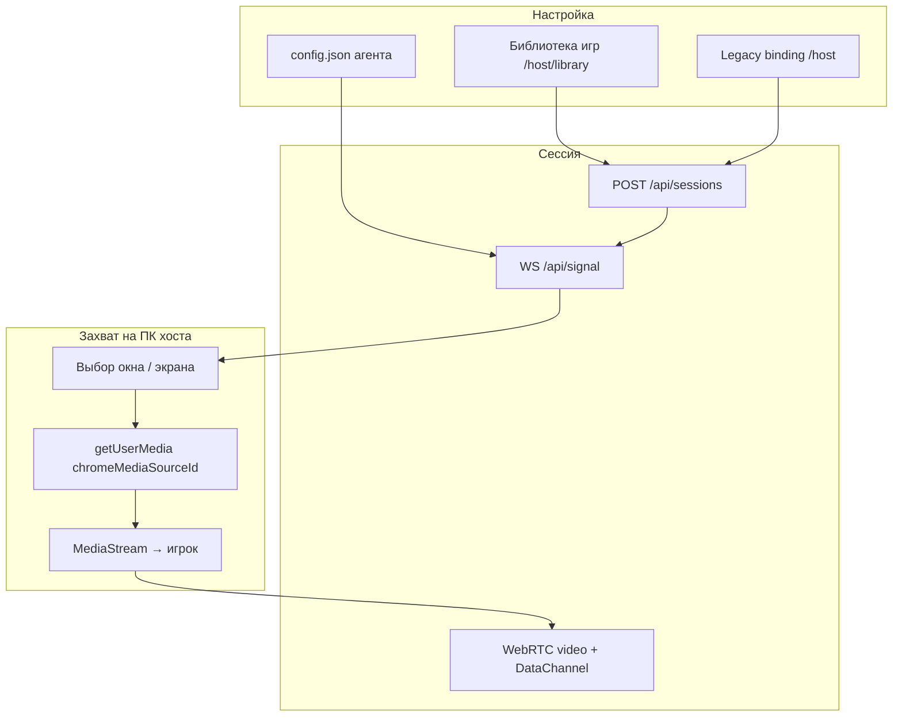
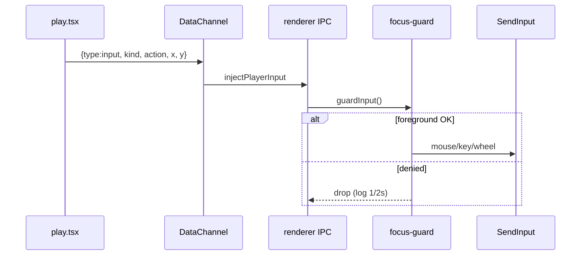

# DecentralHub — Хостинг: как работает привязка к окну и как тестировать

> Отдельный гайд к [TESTPLAN.md](./TESTPLAN.md) и [MARATHON.md](./MARATHON.md).  
> Фокус: **как хост «цепляется» к окну игры**, что видит игрок, и как это проверить на Windows.

---

## Содержание

1. [Три режима хостинга](#1-три-режима-хостинга)
2. [Привязка игры (binding)](#2-привязка-игры-binding)
3. [Захват окна — главная механика](#3-захват-окна--главная-механика)
4. [Запуск процесса и focus guard](#4-запуск-процесса-и-focus-guard)
5. [Ввод игрока](#5-ввод-игрока)
6. [Жизненный цикл сессии](#6-жизненный-цикл-сессии)
7. [Чеклист ручного тестирования](#7-чеклист-ручного-тестирования)
8. [Автотесты и smoke](#8-автотесты-и-smoke)
9. [Troubleshooting](#9-troubleshooting)
10. [Известные ограничения и backlog](#10-известные-ограничения-и-backlog)

---

## 1. Три режима хостинга

| Режим | Где | Захват | Запуск игры | Ввод |
|-------|-----|--------|-------------|------|
| **Electron-агент** | `artifacts/host-agent` | `desktopCapturer` → окно/экран | spawn `.exe` или `openExternal(url)` | SendInput / ViGEm |
| **Браузерный хост** | `artifacts/web/.../browser-play.tsx` | iframe canvas или `getDisplayMedia` | iframe с `browserHostUrl` | DOM-события в canvas |
| **Legacy binding** | `binding-form.tsx` | через агент | `boundAppPath` / `boundUrl` на профиле | как у агента |



**Важно:** привязка к окну — это **не** отдельная OS-фича «приклеить HWND». Платформа:

1. Запускает игру (exe) или открывает URL в браузере.
2. Перечисляет окна через Electron `desktopCapturer.getSources`.
3. **Эвристически** находит нужное окно по заголовку (title).
4. Стримит именно этот source через WebRTC.

---

## 2. Привязка игры (binding)

### 2.1 Библиотека (рекомендуемый путь)

**UI:** `/host/library` → `artifacts/web/src/pages/host/library.tsx`  
**API:** `POST /api/hosts/:hostToken/library`

| Тип игры | Поля в library entry | Что происходит при сессии |
|----------|----------------------|---------------------------|
| **Native (Steam/exe)** | `appPath`, `launchArgs?` | `spawn(appPath)` → PID → focus guard |
| **Browser** | `boundUrl` (https) | `shell.openExternal` → guard отключён → watch браузера |

Агент подтягивает библиотеку через `fetchLibrary()` и при «В сеть» передаёт `gameId` в `POST /api/sessions`.

### 2.2 Legacy binding (профиль хоста)

**UI:** `binding-form.tsx` на дашборде  
**Поля:** `boundAppPath`, `boundUrl`, `boundAppLabel`, цены, расписание

Используется, если игра не в библиотеке. Приоритет у **library entry** для текущего `gameId`.

### 2.3 Browser-host session (без агента)

**API:** `POST /api/sessions/browser-host`  
Временный host row с `boundUrl = game.browserHostUrl`.  
Игрок и хост оба в браузере — захват через canvas/tab share, не через desktopCapturer.

### 2.4 Тест-сессия

**UI:** дашборд → «Проверить самому» (`createTestSession`)  
**API:** `POST /api/sessions/test` — `isTest: true`, биллинг не списывается.

| Сценарий | Куда открывается |
|----------|------------------|
| Внешний URL (не iframe) | `/host/play/:sessionId` — «Поделиться вкладкой» |
| Встроенная игра (Rogue Fable) | `/play/i/:inviteCode` в новой вкладке |

---

## 3. Захват окна — главная механика

**Код:** `captureScreen(cfg)` в `artifacts/host-agent/src/renderer/index.ts`

### 3.1 Источники

Main process: IPC `capture:get-sources` → `desktopCapturer.getSources({ types: ["window", "screen"] })`.

Каждый source: `{ id, name }` — `id` вида `window:…` или `screen:…`, `name` = **заголовок окна** (как в Alt+Tab).

### 3.2 Порядок выбора окна

```
1. cfg.captureSourceName     ← ручной выбор в настройках агента («Цель захвата»)
2. Browser game (boundUrl):
   └─ findBrowserCaptureSource() — до 5 попыток × 2 сек
   └─ pickWindowManually() при провале
3. Native game:
   └─ targetExeName() = basename(appPath) без .exe
   └─ sources.find(name.includes(targetName)) — 5×2 сек
   └─ если 1 игра в library → fallback на весь экран (screen:)
   └─ иначе pickWindowManually()
4. Last resort: primary screen или ошибка со списком имён окон
```

### 3.3 Browser: `findBrowserCaptureSource`

Hostname из `boundUrl` (без `www.`):

1. Окно, где title содержит **hostname + hint браузера** (chrome, edge, firefox…)
2. Любое окно с hostname
3. Любое окно с hint браузера

**Пример:** `boundUrl = https://shellshock.io` → ищем окно с `shellshock.io` в title.

### 3.4 Native: `targetExeName`

Берётся basename exe:

- из library entry для `currentGameId`, иначе
- из `cfg.appPath`

**Пример:** `C:\Games\rf3\RogueFable3.exe` → ищем окно, в title которого есть `roguefable3`.

### 3.5 Ручной picker

Модалка `#window-picker-modal` — список всех окон + кнопка «Весь экран».  
Выбор сохраняется в `captureSourceName` в config.

### 3.6 После выбора

```text
getUserMedia({
  video: { mandatory: { chromeMediaSource: "desktop", chromeMediaSourceId: sourceId } }
})
→ RTCPeerConnection.addTrack
→ setCaptureSource(name) → RTMP relay (если включён)
```

`captureMode: "native"` (DXGI/NVENC) **не реализован** — принудительно `chromium`.

---

## 4. Запуск процесса и focus guard

**Код:** `artifacts/host-agent/src/main/app-launcher.ts`, `focus-guard.ts`

### 4.1 Native exe

```text
spawnNativeApp(appPath, args)
  → setAllowedTarget(child.pid)     // focus guard ВКЛ
  → on('exit') → app:game-exited → teardown сессии
```

### 4.2 Browser URL

```text
shell.openExternal(url)
  → setAllowedTarget(null, { guardDisabled: true })   // guard ВЫКЛ
  → startBrowserWatch(url)                             // poll каждые 10 сек
```

### 4.3 Focus guard (только native)

| Состояние | Поведение |
|-----------|-----------|
| `allowedPid` задан | SendInput только если foreground PID — потомок `allowedPid` |
| `guardDisabled` | Ввод всегда разрешён (browser games) |
| `inputBlocked` (panic) | Ввод запрещён |
| Win32 init failed | **fail-closed** — ввод блокируется |

**Panic:** `Ctrl+Shift+End` → блокировка ввода + teardown.

### 4.4 Browser watch (конец сессии)

`browserWindowStillOpen(hostHint)`:

- Есть ли **любое** окно браузера? → сессия жива.
- Если hostname в title — дополнительный match.
- 30 сек grace → 3 подряд «нет окна» → `fireExit()` → авто-завершение.

**Слабое место:** Chrome с другой вкладкой = «жив», даже если игра закрыта.

---

## 5. Ввод игрока



### Browser-play + внешний сайт

Игрок шлёт ввод в canvas → `postAgentInput()` → `http://127.0.0.1:18080/input` → тот же injector.

**Требование:** Electron-агент запущен на том же ПК (ping :18080).

### Browser-play + iframe (Rogue Fable)

Ввод напрямую в Phaser canvas, агент не нужен.

---

## 6. Жизненный цикл сессии

| Этап | Агент | API |
|------|-------|-----|
| Онлайн | `connect()` → `createSession` | `sessions.status = waiting` |
| Игрок зашёл | WS `peer-joined` → `onPlayerJoined` | `claim` → `active` |
| Запуск | `launchEntry` / `launchApp` | — |
| Захват | `captureScreen` | — |
| Стрим | WebRTC offer/answer/ICE | heartbeat 15s → `lastSeenAt` |
| Ввод | DataChannel → SendInput | billing tick |
| Выход | `teardownAsync`: push save, end session, killApp | `PATCH .../end` |
| Reconnect | defer teardown 20–30s | — |

**Heartbeat агента:** main process каждые 15s → `POST /api/hosts/heartbeat`.  
Дашборд проверяет `GET http://127.0.0.1:18080/ping` для статуса «Агент подключен».

---

## 7. Чеклист ручного тестирования

> Заполняй в [TESTLOG.md](./TESTLOG.md): `| # | Сценарий | Ок/Баг | Примечание |`

### Предусловия

```bat
scripts\dev-local.bat
pnpm --filter @workspace/host-agent run dev
```

- API: `http://localhost:8080/api/healthz` → ok  
- Web: `http://localhost:5000`  
- Агент: tray → токен хоста + Platform URL `http://localhost:5000`

---

### A. Агент: подключение

| # | Шаг | Ожидание | ✓ |
|---|-----|----------|---|
| A1 | Дашборд `/host` | «Агент подключен» (ping :18080) | |
| A2 | Остановить агент | «Агент не подключен», подсказка скачать | |
| A3 | `--bind-code=XXXX` deep link | Токен подставился в агент | |

---

### B. Native игра (exe) — привязка к окну

| # | Шаг | Ожидание | ✓ |
|---|-----|----------|---|
| B1 | Library: добавить exe, «В сеть» | Игра запустилась | |
| B2 | Лог агента | `Capturing source: <имя окна>` | |
| B3 | Окно с **другим** title (Steam overlay) | Автопоиск может промахнуться → picker | |
| B4 | Настройки → «Цель захвата» → выбрать окно | Повтор сессии стримит выбранное | |
| B5 | Игрок `/play/i/...` | Видео ≤10 сек, ввод в игру | |
| B6 | Alt+Tab на другой app | **Ввод не доходит** (focus guard) | |
| B7 | Вернуться в игру | Ввод снова работает | |
| B8 | Закрыть игру | Сессия ended, игрок «Хост отключился» | |
| B9 | Kill агента (tray exit) | Disconnect ≤30 сек | |

---

### C. Browser игра (boundUrl)

| # | Шаг | Ожидание | ✓ |
|---|-----|----------|---|
| C1 | Library: `boundUrl` https, сессия | Браузер открыл URL | |
| C2 | Захват | Окно Chrome/Edge с hostname в title | |
| C3 | Ввод | Работает **везде на рабочем столе** (guard off) | |
| C4 | Закрыть **все** окна браузера | Сессия auto-end (~30s+30s) | |
| C5 | Chrome открыт, вкладка игры закрыта | Сессия **может не завершиться** (известный баг) | |

---

### D. Браузерный хост (browser-play)

| # | Шаг | Ожидание | ✓ |
|---|-----|----------|---|
| D1 | Дашборд «Проверить самому» + внешний URL | `/host/play/:id`, share tab | |
| D2 | Rogue Fable test | iframe/canvas stream | |
| D3 | Статусы HUD | RU: ПОДКЛЮЧЕНО / СОЕДИНЕНИЕ… | |
| D4 | Внешний URL + агент | postAgentInput → мышь на хосте | |

---

### E. Сейвы (native)

| # | Шаг | Ожидание | ✓ |
|---|-----|----------|---|
| E1 | Сессия с save paths | pull в начале | |
| E2 | Конец сессии | push в облако, **локальные файлы на месте** | |
| E3 | Вторая сессия | restore из cloud | |

---

### F. Паника и безопасность

| # | Шаг | Ожидание | ✓ |
|---|-----|----------|---|
| F1 | `Ctrl+Shift+End` во время стрима | Ввод заблокирован, сессия завершается | |
| F2 | SSE `/events/stream` без токена | 401 | |

---

## 8. Автотесты и smoke

| Что | Команда | Покрывает |
|-----|---------|-----------|
| Ping + input API агента | `pnpm --filter @workspace/host-agent test` | parseInputEvent, CORS, `/input` 401 |
| Agent API | `scripts/agent-api-smoke.sh` | heartbeat, zip, auth |
| Signaling | `node scripts/signaling-smoke.mjs` | WS relay |
| Session lifecycle | `scripts/session-lifecycle.sh` | create/end, ghost check |
| P2P billing | `BILLING_SMOKE=1 scripts/session-lifecycle.sh` | billing_events |

**Не покрыто автоматически (только ручной Windows):**

- `captureScreen` heuristics
- `focus-guard` PID tree
- `browserWindowStillOpen`
- WebRTC video frames
- SendInput в реальной игре

---

## 9. Troubleshooting

| Симптом | Вероятная причина | Что делать |
|---------|-------------------|------------|
| «Окно игры не найдено» | Title не содержит exe basename | Ручной picker или «Цель захвата» |
| Стримит весь рабочий стол | Fallback screen (1 игра в library) | Выбрать окно вручную |
| Игрок видео нет, ICE ok | Неверный source / 0×0 capture | Перевыбрать окно, не минимизировать |
| Ввод не доходит (native) | Focus guard — игра не в foreground | Alt+Tab в игру |
| Ввод не доходит (browser external) | Агент не запущен | `curl http://127.0.0.1:18080/ping` |
| «Агент не подключен» | Порт 18080 занят / firewall | Перезапуск агента, `EADDRINUSE` в логе |
| Browser сессия не ends | Любой Chrome = alive | Закрыть все окна браузера |
| ViGEm не работает | DLL не установлен | ViGEmBus + `ViGEmClient.dll` |
| iframe пустой | X-Frame-Options | Использовать tab capture (`/host/play`) |

### Полезные логи

- Агент renderer: DevTools в окне настроек (если включено) или console в tray UI
- Main: `%APPDATA%/cloud-gaming-host-agent/logs/` (см. `logger.ts`)
- API: терминал `dev-local.bat`

### SQL для ghost-сессий

```sql
SELECT id, status, ended_at FROM sessions WHERE status = 'active' AND ended_at IS NOT NULL;
```

---

## 10. Известные ограничения и backlog

| ID | Проблема | Статус |
|----|----------|--------|
| H-01 | Match по title, не HWND/PID | fixed | M-44 — shared `window-match.ts`, title-only heuristics |
| H-02 | Browser watch: любой Chrome = alive | fixed | M-45 — `browserWindowStillOpen`, any browser title hint |
| H-03 | `captureMode: native` не реализован | coerce → chromium |
| H-04 | Limited-user launch | fixed | MARATHON C3-S05 — spawnNativeApp + tryLimitedLaunch |
| H-05 | RTMP relay drift от WebRTC source | fixed | MARATHON C3-S06 — syncRtmpWindowTitle on capture:set-source |
| H-06 | Renderer 3300+ строк | MARATHON C3-S08 |
| H-07 | Unit tests capture/focus | fixed | M-46 — capture.test.mjs + focus-guard.test.mjs |
| H-08 | HWND-based match после spawn | improvement |

### Планируемые улучшения

1. **HWND match** — после `spawn` запоминать PID → искать foreground HWND процесса.
2. **Browser watch** — match по hostname в title, не «любой браузер».
3. **Unit tests** — `findBrowserCaptureSource`, `targetExeName`, `browserWindowStillOpen`.
4. **Picker UX** — thumbnails из `desktopCapturer` в модалке.
5. **Опциональный browser focus guard** — ввод только если foreground browser содержит hostname игры.
6. **Dashboard UX-02** — расширенный troubleshoot (MARATHON).

---

## Карта кода (quick reference)

| Что | Файл | Функция |
|-----|------|---------|
| Выбор окна | `host-agent/src/renderer/capture.ts` | `captureScreen`, `pickWindowManually` |
| Title match | `host-agent/src/shared/window-match.ts` | `findBrowserCaptureSource`, `findNativeCaptureSource` |
| Запуск exe/url | `host-agent/src/main/app-launcher.ts` | `launchEntry`, `launchApp`, `startBrowserWatch` |
| Focus guard | `host-agent/src/main/focus-guard.ts` | `setAllowedTarget`, `guardInput` |
| SendInput | `host-agent/src/main/input-injection.ts` | `injectPlayerInput` |
| Local input HTTP | `host-agent/src/main/ping-server.ts` | `POST /input` |
| Browser host UI | `web/src/pages/host/browser-play.tsx` | `startStreaming`, share tab |
| Тест-сессия | `web/src/pages/host/dashboard.tsx` | `handleTestSession` |
| Сессии API | `api-server/src/routes/sessions.ts` | `POST /sessions`, `/test`, `/browser-host` |
| Signaling | `api-server/src/lib/signaling.ts` | `authenticate`, relay |

---

*Обновляй этот файл при изменении heuristics захвата или чеклиста. Связанные документы: [TESTPLAN.md](./TESTPLAN.md) фаза 4, [MARATHON.md](./MARATHON.md) Cycle 3.*
